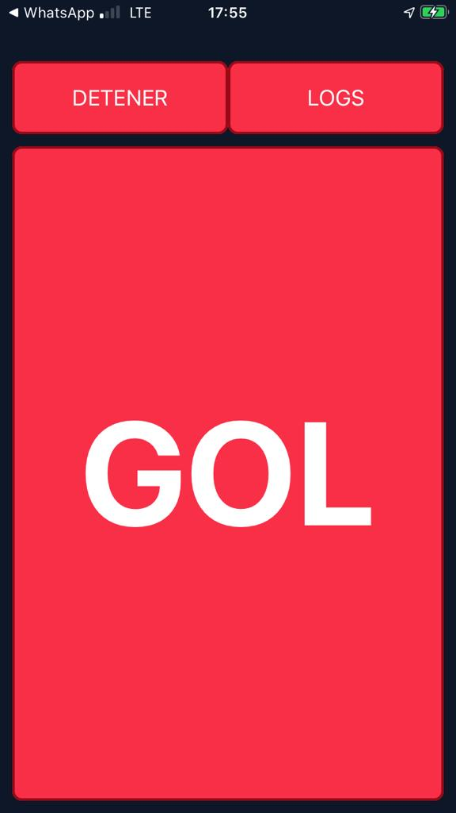

# GoProGoals

A React Native App to record your goals! [Video Samples](https://www.youtube.com/playlist?list=PLE8Be1z3NnYjlIO-RfyEWX96b0Cmx0zLE)

It is required:

- A GoPro Hero3 Cam
- An Iphone (not tested on Android) 
- Xcode, [CocoaPods](https://guides.cocoapods.org/using/getting-started.html#getting-started) on your computer

## How it works

This app is just a big button waiting to be pressed. 

Cam is recording your game until a goal happens. After that, hit the button.

Your cellphone will get a video with the last 16 seconds of the recording.



#### How it works: More in depth
 - Before opening the app, cell must be connected to Cam's wifi. 
 - The app has a "Start Recording" button. Hit that.
 - When a goal happens, hit "GOAL".
    - App will make the cam to stop recording and get the video's name.
    - App will make the cam to start recording again.
    - App will start downloading the last 16 seconds from the recording.
   

## How can i use it on my phone

```
# clone this repo
git clone git@github.com:santiagovazquez/GoProGoals.git && cd GoProGoals && npm install
# edit constants.js file and put your cam wifi password on CAMARA_PASSWORD 
vim js/constants.js
# Connect your iphone
# Open GoProGoals.xcworkspace 
cd ios && pod install && open ios/GoProGoals.xcworkspace
# Clean, build and Run
```


## Disclaimer
This app is tested on XCode 11.3 and iPhone 6S. It has some known issues. Please feel free to fork or contribute with PRs.


